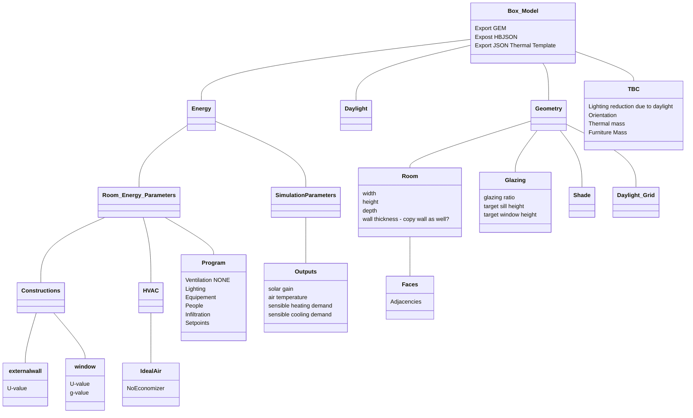

```mermaid
classDiagram
    Class Box_Model
    Box_Model -- Energy
    Box_Model -- Daylight
    Box_Model -- Geometry
    Box_Model -- TBC

    Box_Model: Export GEM
    Box_Model: Expost HBJSON
    Box_Model: Export JSON Thermal Template

    TBC: Lighting reduction due to daylight
    TBC: Orientation
    TBC: Thermal mass
    TBC: Furniture Mass

    Energy -- Room_Energy_Parameters
    Room_Energy_Parameters -- Constructions
    Room_Energy_Parameters -- HVAC
    Room_Energy_Parameters -- Program

    HVAC -- IdealAir

    IdealAir: NoEconomizer

    Constructions -- external wall
    Constructions -- window

    Program: Ventilation NONE
    Program: Lighting
    Program: Equipement
    Program: People
    Program: Infiltration
    Program: Setpoints

    external wall: U-value
    window: U-value
    window: g-value

    Energy -- SimulationParameters
    SimulationParameters -- Outputs

    Outputs: solar gain
    Outputs: air temperature
    Outputs: sensible heating demand
    Outputs: sensible cooling demand

    Geometry -- Room
    Geometry -- Glazing
    Geometry -- Shade
    Geometry -- Daylight_Grid

    Room: width
    Room: height
    Room: depth
    Room: wall thickness - copy wall as well?

    Room -- Faces

    Faces: Adjacencies

    Glazing: glazing ratio
    Glazing: target sill height
    Glazing: target window height


```
